Este archivo te servirá como una "hoja de trucos" (cheatsheet) rápida para cuando estés documentando tus propias herramientas. Guárdalo como `markdown.md`.

```markdown
# Texto
## Formato
Estilos de texto básicos:
**Negrita** -> `**texto**` o `__texto__`
*Cursiva*  -> `*texto*` o `_texto_`
~~Tachado~~ -> `~~texto~~`
`Código en línea` -> `` `código` ``

## Listas
### Desordenada
- Elemento 1 (usar `-`, `*` o `+`)
- Elemento 2
  - Sub-elemento (identar con 2 espacios)

### Ordenada
1. Primero
2. Segundo
3. Tercero

### Tareas
- [x] Tarea terminada
- [ ] Tarea pendiente

# Estructura
## Encabezados
# Nivel 1 (Título)
## Nivel 2 (Sección)
### Nivel 3 (Subsección)
#### Nivel 4
##### Nivel 5
###### Nivel 6

## Tablas
Estructura básica de tabla:

| Header | Centrado | Derecha |
| :--- | ::---: | ---: |
| Celda | Texto | $100 |
| Celda | Texto | $50 |

## Bloques
### Codigo
Para bloques de código con resaltado de sintaxis:
```bash
echo "Hola Mundo"
```

### Citas
> Esto es una cita o un bloque de nota.
> Puede tener múltiples líneas.

### Linea
Línea horizontal divisoria:
--- (Tres guiones)

# Multimedia
## Enlaces
Enlace con texto: `[Nombre](https://url.com)`
Enlace directo: `<https://url.com>`

## Imagenes
Imagen con texto alternativo:
``

## Mermaid
Diagramas de flujo y más:

### Flujo

```mermaid
graph TD;
    A[Inicio] --> B{¿Funciona?};
    B -- Sí --> C[Listo];
    B -- No --> D[Arreglar];
```


### Secuencia


# Extras
## Caracteres
Para escribir caracteres especiales de markdown sin que se ejecuten, usa el escape `\`:
\*Esto no será cursiva\*
\# Esto no será un título
```

### Ejemplos de uso con `ayu`:

*   **Ver cómo hacer tablas:**
    `ayu markdown Estructura Tablas`
*   **Ver cómo hacer diagramas Mermaid:**
    `ayu markdown Multimedia Mermaid`
*   **Ver formatos de texto (negrita, cursiva):**
    `ayu markdown Texto Formato`
*   **Listar todo el índice de markdown:**
    `ayu -s markdown`

Con esto ya tienes una base sólida para documentar cualquier otra herramienta en el futuro. ¡Tu sistema `ayu` ya está tomando mucha forma!
